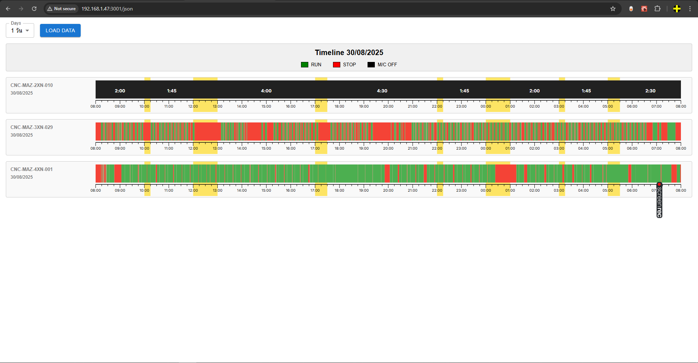

# Machine Timeline Viewer

โปรเจกต์นี้เป็นระบบแสดงผลสถานะการทำงานของเครื่องจักร (RUN / STOP / OFF) ในรูปแบบ **timeline กราฟ** โดยใช้เทคโนโลยี:

- 🟢 **React + Next.js 13+ (App Router)**
- 🟣 **Material UI (MUI)**
- ⚫ **D3.js**
- 🔵 ข้อมูลแบบ Mock (จากไฟล์ JSON)

---

## 🧱 Tech Stack

### 🟣 Material UI (MUI)
ใช้ [Material UI (MUI)](https://mui.com/) สำหรับการจัดการ **layout**, **form controls** และ **การแสดงผล UI อื่น ๆ** ภายในโปรเจกต์

- ใช้ `Box`, `Grid`, `Stack` ในการจัดโครงสร้าง layout ให้ responsive และ maintainable
- ใช้ component ต่าง ๆ ของ MUI เช่น:
  - `Select`, `DatePicker`, `TextField`, `Switch` สำหรับ interaction
  - `Typography`, `Paper`, `Chip`, `Card` สำหรับการแสดงผลข้อมูล
- รองรับการปรับแต่งผ่าน MUI Theme เพื่อให้ UI สม่ำเสมอทั้งระบบ

📌 **MUI ถูกใช้ในการจัดโครงสร้างและ UI ส่วนใหญ่ของหน้าเว็บ ยกเว้นส่วนของกราฟ**


### ⚫ D3.js
ใช้ [D3.js](https://d3js.org/) สำหรับ **วาดกราฟลงใน `<svg>`** เท่านั้น

- ใช้ฟังก์ชันของ D3 เช่น `scaleTime`, `scaleLinear`, `scaleOrdinal` สำหรับการคำนวณตำแหน่งและขนาดในกราฟ
- สร้างกราฟแบบ timeline/status bar ของแต่ละเครื่อง โดยวาด `<rect>` หรือ `<path>` ลงใน `<svg>` ตามข้อมูลที่ได้รับ
- วาดกราฟแบบ declarative (ไม่ใช้ D3 จัดการ DOM โดยตรง)

```tsx
<svg width={width} height={height}>
  {data.map((d, i) => (
    <rect
      key={i}
      x={xScale(d.start)}
      width={xScale(d.end) - xScale(d.start)}
      y={0}
      height={height}
      fill={colorScale(d.status)}
    />
  ))}
</svg>
```
---

## 🔧 Features

- ✅ แสดง Timeline การทำงานของเครื่องจักรแต่ละตัว แบบกราฟแนวนอน
- 📅 **เลือกวันเริ่มต้น และจำนวนวันย้อนหลัง (เช่น 1–5 วัน)**:
  - เช่น เริ่มจาก **30/08/2025** จำนวน **2 วัน** → แสดงข้อมูลช่วง **30–31 ส.ค. 2025**
- ⏱ แสดงสถานะของเครื่องจักรเป็นแถบสี:
  - 🟩 **RUN** (สีเขียว)
  - 🟥 **STOP** (สีแดง)
  - ⬛ **M/C OFF** (สีดำ)
- 💬 **Tooltip**: แสดงรายละเอียดสถานะ พร้อมวันที่-เวลาเริ่มต้นและสิ้นสุดเมื่อ hover
- 🌙 **Highlight เวลาพัก**: รองรับการเน้นแถบเวลาที่เป็นช่วงพัก (Break Time)
- 🕒 **Time Scale (แถบเวลาล่าง)**: แสดงหน่วยเวลาอัตโนมัติ เช่น ชั่วโมง/วัน พร้อมปรับตามช่วงเวลาที่เลือก
- 📏 **Responsive Layout**: ปรับขนาดอัตโนมัติตาม container ด้วย `ResizeObserver`
- 🌗 **รองรับ Shift ข้ามวัน**: เช่น เริ่ม 22:00 น. และจบ 06:00 ของวันถัดไป
- ⛔ **แสดง Label เฉพาะช่วง "UNDEFINED: M/C OFF"**:
  - ✅ รองรับการนับเวลาแบบ **รวมช่วงพัก** (เวลาสะสมต่อเนื่อง)
  - ✅ หรือ **เริ่มนับใหม่หลังเวลาพัก** โดยตัดช่วง highlight ออกก่อนคำนวณ
- 📂 โหลดข้อมูลจากไฟล์ JSON ภายใน `/public/data`
- 🧪 มี Mock API สำหรับทดสอบ พร้อมจัดการกรณี Loading และ Error
- ♻️ รีเฟรชข้อมูลด้วยปุ่ม **"Load Data"**

---

## 🖼 Screenshot



---

## 🚀 เริ่มต้นใช้งาน (Getting Started)

```bash
git clone https://github.com/suwitna/chart-timeline-mui-d3.git
cd chart-timeline-mui-d3
npm install
npm run dev
```

### 📦 Install Dependency เพิ่มเติม (สำหรับใช้ Component) ในโปรเจกต์อื่น

หากนำ `MachineItem` component ไปใช้ในโปรเจกต์อื่น  
กรุณาติดตั้ง dependencies ต่อไปนี้:

```bash
npm install d3 dayjs

```
| Package     | ใช้ทำอะไร                                                |
| ----------- | -------------------------------------------------------- |
| `d3`        | ใช้สร้างกราฟ timeline (ผ่าน D3.js)                       |
| `dayjs`     | จัดการวันที่และเวลา (เบา เร็วกว่า moment.js)             |
| `@types/d3` | (เฉพาะ TypeScript) สำหรับ IntelliSense และ type-checking |

✅ หมายเหตุ:
ไม่จำเป็นต้องติดตั้ง mssql หรือ msnodesqlv8 เว้นแต่คุณต้องการดึงข้อมูลจาก SQL Server โดยตรง – โปรเจกต์นี้ใช้เพียง mock API (/api/json-log) สำหรับตัวอย่างเท่านั้น

---

## 📁 Project Structure

```txt
/src
├── app
│   ├── api/machine-log
│   │       ├── api/machine-log  <-- API ดึงข้อมูลจาก MSSQL
│   │       ├── api/mock-log     <-- mock API สุ่มข้อมูล
│   │       └── api/json-log     <-- mock API สำหรับดึง JSON
│   │
│   ├── cnc/page.tsx             <-- ตัวอย่างหน้าจอติดต่อกับฐานข้อมูล
│   ├── demo/page.tsx            <-- ตัวอย่างอย่างง่าย
│   ├── json/page.tsx            <-- ตัวอย่างหน้าจอติดต่อกับ JSON log data ต่อวัน (จากข้อมูลตัวอย่าง)
│   ├── mock/page.tsx            <-- ตัวอย่างหน้าจอติดต่อกับ Mock data แบบสุ่ม
│   └── sqltest/page.tsx         <-- ทดสอบติดต่อฐานข้อมูล
│
├── components
│   ├── MachineItem.tsx          <-- สร้าง timeline graph
│   ├── MachineStatusBar.tsx     <-- แสดงแถบสีรายสถานะ เช่น Run, Stop, UNDEFINED
│   └── TimeScale.tsx            <-- จัดการ Scale/time x axis
│
├── data
│   └── mockData.ts              <-- ข้อมูลโครงสร้าง JSON, และ Config
│
├── types
│   └── machine.ts               <-- ข้อมูลโครงสร้าง JSON, และ Config
│
/public
└── data                         <-- JSON log data ต่อวัน
 ```

---

## JSON Log Format

ข้อมูลถูกเก็บในรูปแบบ JSON เป็น array ของเครื่องจักรแต่ละตัว (`machine`) โดยแต่ละเครื่องจะมีข้อมูล `timeline` เป็น array ของช่วงเวลาสถานะ

แต่ละช่วงเวลาจะระบุ:

- วันที่และเวลาที่เริ่ม (`start_date`, `start_time`) (เช่น "2025-08-30", "06:25:24")
- วันที่และเวลาที่สิ้นสุด (`end_date`, `end_time`) (เช่น "2025-09-01", "11:22:40")
- ค่าเวลาที่เป็น timestamp (`start_epoch`, `end_epoch`) สำหรับคำนวณช่วงเวลา
- สถานะของเครื่องจักร (`status_name`) เช่น Run, Stop, UNDEFINED

---

## React Timeline Page Component

ไฟล์นี้เป็น React Functional Component ที่ใช้แสดงข้อมูล Timeline ของเครื่องจักรจาก API endpoint แบบไดนามิก
```
🔍 สรุปฟีเจอร์หลักของหน้าเว็บนี้
| ฟีเจอร์                  | รายละเอียด                                                   |
| ------------------------ | ------------------------------------------------------------ |
| 📅 เลือกช่วงเวลา         | ผู้ใช้เลือกจำนวนวันที่จะแสดงข้อมูลได้ (1-5 วัน) จาก dropdown |
| 📥 ปุ่มโหลดข้อมูล        | ปุ่ม `Load Data` เพื่อดึงข้อมูลจาก API ตามจำนวนวัน           |
| 🧾 แสดงข้อมูลเครื่องจักร | แต่ละเครื่องจะแสดงกราฟสถานะ (RUN, STOP, M/C OFF)             |
| 📊 Timeline Header       | แสดงวันที่เริ่มต้น - วันที่สิ้นสุด ของช่วงเวลาที่เลือก       |
| 🟩🟥⬛ Legend             | อธิบายสีแต่ละสถานะของเครื่องจักร                             |
| 🔄 Loading State         | แสดง `CircularProgress` เมื่อโหลดข้อมูล                      |
| ⚠️ Error State           | แสดงข้อความผิดพลาดถ้าดึงข้อมูลล้มเหลว                        |

```
[Dropdown: เลือกจำนวนวัน]   [ปุ่ม Load Data]

-----------------------------------------------------
Timeline 30/08/2025 - 01/09/2025
[■ RUN] [■ STOP] [■ M/C OFF]
-----------------------------------------------------
```
┌────────────────────┬──────────────────────────────────────┐
│ MACHINE A          │ ███░░░███▒▒▒████... (MachineItem)     │
│ 30/08/2025 - ...   │                                      │
└────────────────────┴──────────────────────────────────────┘

┌────────────────────┬──────────────────────────────────────┐
│ MACHINE B          │ ███░░░███▒▒▒████... (MachineItem)     │
└────────────────────┴──────────────────────────────────────┘
```
### การทำงานหลัก

- เลือกจำนวนวันที่จะโหลดข้อมูลผ่าน dropdown (1-5 วัน)
- กดปุ่ม `Load Data` เพื่อเรียก API `/api/json-log` ด้วยพารามิเตอร์วันที่เริ่มต้นและจำนวนวัน
- แสดงแถบสถานะ Timeline ของแต่ละเครื่องจักรในช่วงวันที่เลือก
- มีการแสดงสถานะโหลดข้อมูล และแสดงข้อความ error เมื่อโหลดข้อมูลล้มเหลว
- มี Legend แสดงสีสถานะต่าง ๆ (RUN, STOP, M/C OFF)
- ใช้ Material UI สำหรับ UI components และ dayjs สำหรับจัดการวันที่

### โครงสร้าง State

| ชื่อ State  | คำอธิบาย                         |
|-------------|----------------------------------|
| `logs`      | เก็บข้อมูล timeline ของแต่ละเครื่องจักรที่โหลดมา (array ของ `GroupedMachineLog`) |
| `numDays`   | จำนวนวันที่เลือกเพื่อแสดง timeline (state หลัก)       |
| `tempNumDays` | ค่าเลือกวันที่ใน dropdown (ยังไม่อัปเดต `numDays`) |
| `loading`   | สถานะการโหลดข้อมูลจาก API       |
| `error`     | เก็บข้อความ error หากโหลดข้อมูลไม่สำเร็จ |
| `loaded`    | ตัวแปรบอกว่าโหลดข้อมูลเสร็จสมบูรณ์แล้ว (ใช้สำหรับแสดงกราฟ) |

### Props ที่ใช้ส่งเข้า `MachineItem` component

- `log`: ข้อมูล **timeline** ของเครื่องจักร (หนึ่งใน array ของ logs)
- `startDate`: วันที่เริ่มต้น (เช่น `"2025-08-30"`)
- `numDays`: จำนวนวันที่ต้องการแสดง
- `chartHeight`: ความสูงของกราฟ (ค่าเริ่มต้น: `50`)
- `startHour`: เวลาเริ่มต้นในแต่ละวัน (ค่าเริ่มต้น: `"00:00:00"`)
- `endHour`: เวลาสิ้นสุดในแต่ละวัน (ค่าเริ่มต้น: `"23:59:59"`)
- `showTooltip`: แสดง tooltip หรือไม่ (ค่าเริ่มต้น: `true`)
- `showTimeScale`: แสดง time scale (แกนเวลา) หรือไม่ (ค่าเริ่มต้น: `true`)
- `highlightRanges`: ช่วงเวลาที่ต้องการไฮไลต์ใน timeline
- `statusColorMap`: แผนที่สีสำหรับสถานะต่าง ๆ ของเครื่องจักร (ค่าเริ่มต้น: `defaultStatusColorMap`)
- `paddingLeft`: ช่องว่างด้านซ้ายของกราฟ (ค่าเริ่มต้น: `30`)
- `paddingRight`: ช่องว่างด้านขวาของกราฟ (ค่าเริ่มต้น: `30`)
- `showDuration`: แสดงเวลาช่วงสถานะ `undefined` หรือไม่ (ค่าเริ่มต้น: `true`)
- `showTotalTime`: แสดงเวลารวมของช่วง `undefined` หรือไม่ (ค่าเริ่มต้น: `false`)

---

| ชื่อพารามิเตอร์     | ประเภท    | ค่าที่รับ                            | คำอธิบาย                                                | ตัวอย่างค่า                                                 |
|----------------------|-----------|--------------------------------------|----------------------------------------------------------|--------------------------------------------------------------|
| `log`               | object    | ข้อมูล log ของเครื่องจักร          | เป็นข้อมูล array ของช่วงเวลาสถานะ เช่น run/stop/etc.   | `mockMachineLogs`                                            |
| `startDate`         | string    | วันที่เริ่มแสดงข้อมูล               | ใช้รูปแบบ `YYYY-MM-DD`                                   | `'2025-09-03'`                                               |
| `numDays`           | number    | จำนวนวัน                            | จำนวนวันของ timeline ที่จะแสดง                          | `1`                                                          |
| `chartHeight`       | number    | ความสูงของกราฟ                      | ความสูงของแถบแสดงสถานะเครื่อง                          | `50`                                                         |
| `startHour`         | string    | เวลาเริ่มต้น                        | เวลาเริ่มของ shift (รูปแบบ `HH:mm:ss`)                  | `'08:00:00'`                                                 |
| `endHour`           | string    | เวลาสิ้นสุด                         | เวลาเลิกงาน/จบ shift (รูปแบบ `HH:mm:ss`)                | `'08:00:00'`                                                 |
| `showTooltip`       | boolean   | แสดง tooltip หรือไม่                | ถ้า `true` แสดง tooltip เมื่อ hover                     | `true`                                                       |
| `showTimeScale`     | boolean   | แสดงแถบเวลา                        | แสดงแถบเวลาแนวนอนด้านล่างของกราฟ                      | `true`                                                       |
| `highlightRanges`   | array     | ช่วงเวลาพัก                         | ช่วงเวลาที่ต้องเน้นพิเศษ เช่น พักเบรก                  | `[ { start: '12:00:00', end: '13:00:00', color: '#FFD600' } ]` |
| `statusColorMap`    | object    | แมพสีของสถานะ                      | กำหนดสีตามสถานะ เช่น run/stop/undefined                | `{ Run: '#509151ff', Stop: '#c9665fff', UNDEFINED: '#3c3c3cff' }` |
| `paddingLeft`       | number    | ช่องว่างซ้าย                        | Padding ทางซ้ายของกราฟ (px)                             | `30`                                                         |
| `paddingRight`      | number    | ช่องว่างขวา                         | Padding ทางขวาของกราฟ (px)                              | `30`                                                         |
| `showDuration`      | boolean   | แสดงเวลาช่วง UNDEFINED             | แสดง label เวลาใน block undefined                       | `true`                                                       |
| `showTotalTime`     | boolean   | รวมเวลาพักในช่วง undefined หรือไม่ | ถ้า `true` นับรวมเวลาพัก, ถ้า `false` หักพักออกก่อนนับ | `false`                                                      |

---

### ตัวอย่างการใช้ MachineItem component:
```tsx
<MachineItem
  log={log}                     // (1) ข้อมูล JSON -->(Required)
  startDate={startDate}         // (2) วันที่เริ่มต้น YYYY-MM-DD -->(Required)
  numDays={numDays}             // (3) จำนวนวันที่ต้องการ -->(Required)
  chartHeight={50}              // (4) ความสูงของตัว Timeline -->(Optional)
  startHour="08:00:00"          // (5) เวลาเริ่มต้นของวัน -->(Optional)
  endHour="08:00:00"            // (6) เวลาสิ้นสุดของวัน -->(Optional)
  showTooltip={true}            // (7) แสดงทูลทิป -->(Optional)
  showTimeScale={true}          // (8) แสดงเวลา -->(Optional)
  highlightRanges = {[          // (9) เวลาพัก -->(Optional)
        { start: '00:00:00', end: '01:00:00', color: '#FFD600' },
        { start: '03:00:00', end: '03:15:00', color: '#FFD600' },
        { start: '05:00:00', end: '05:30:00', color: '#FFD600' },
        { start: '10:00:00', end: '10:15:00', color: '#FFD600' },
        { start: '12:00:00', end: '13:00:00', color: '#FFD600' },
        { start: '17:00:00', end: '17:30:00', color: '#FFD600' },
        { start: '22:00:00', end: '22:15:00', color: '#FFD600' },
    ]}
  statusColorMap = {{           // (10) สีของสถานะต่าง -->(Optional)
        Run: '#509151ff',
        Stop: '#c9665fff',
        UNDEFINED: '#3c3c3cff',
    }}
  paddingLeft={30}              // (11) ช่องว่างกับขอบทางซ้าย -->(Optional)
  paddingRight={30}             // (12) ช่องว่ากับของทางขวา -->(Optional)
  showDuration={true}           // (13) แสดงเวลา UNDEFINED -->(Optional)
  showTotalTime={false}         // (14) เวลา UNDEFINEDม  -->(Optional)
                                // true แสดงต่อเนื่องรวมเวลาพัก, 
                                // false เริ่มนับใหม่หลังเวลาพัก
  />
```

### สามารถปรับค่า Default ต่างๆ ได้
PATH: src/types/machines.ts

```tsx
export const MACHINE_LOG_SHIFT_START = '08:00:00';
export const MACHINE_LOG_SHIFT_END = '08:00:00'; // ของวันถัดไป

export type MachineStatus = 'Run' | 'Stop' | 'UNDEFINED';

export const defaultStatusColorMap: Record<MachineStatus, string> = {
    Run: '#4caf50',
    Stop: '#f44336',
    UNDEFINED: '#212121',
};

export const defaultHighlightRanges = [
    { start: '00:00:00', end: '01:00:00', color: '#FFD600' },
    { start: '03:00:00', end: '03:15:00', color: '#FFD600' },
    { start: '05:00:00', end: '05:30:00', color: '#FFD600' },
    { start: '10:00:00', end: '10:15:00', color: '#FFD600' },
    { start: '12:00:00', end: '13:00:00', color: '#FFD600' },
    { start: '17:00:00', end: '17:30:00', color: '#FFD600' },
    { start: '22:00:00', end: '22:15:00', color: '#FFD600' },
];

export interface MachineLog {
  //id?: number; // optional
  portid: number;
  machine: string;
  start_date: string;  // 'yyyy-mm-dd'
  start_time: string;  // 'HH:mm:ss'
  end_date: string;    // 'yyyy-mm-dd'
  end_time: string;    // 'HH:mm:ss'
  start_epoch: number;
  end_epoch: number;
  state: string;
  status_name: string;
}

export interface GroupedMachineLog {
  machine: string;
  timeline: MachineLog[];
}

export interface HighlightRange {
    start: string; // 'HH:mm:ss'
    end: string;   // 'HH:mm:ss'
    color?: string;
}
```

---

### ตัวอย่างการเรียก API
GET /api/json-log?date=2025-08-30&days=3

Response ตัวอย่าง (JSON):

```json
[
  {
    "machine": "CNC-MAZ-2XN-010",
    "timeline": [
      {
        "portid": 188,
        "machine": "CNC-MAZ-2XN-010",
        "start_date": "2025-08-30",
        "start_time": "00:01:34",
        "end_date": "2025-08-30",
        "end_time": "01:07:10",
        "start_epoch": "1756486894",
        "end_epoch": "1756490830",
        "state": "CLOSED",
        "status_name": "Stop"
      },
      ...
    ]
  },
  ...
]
```
